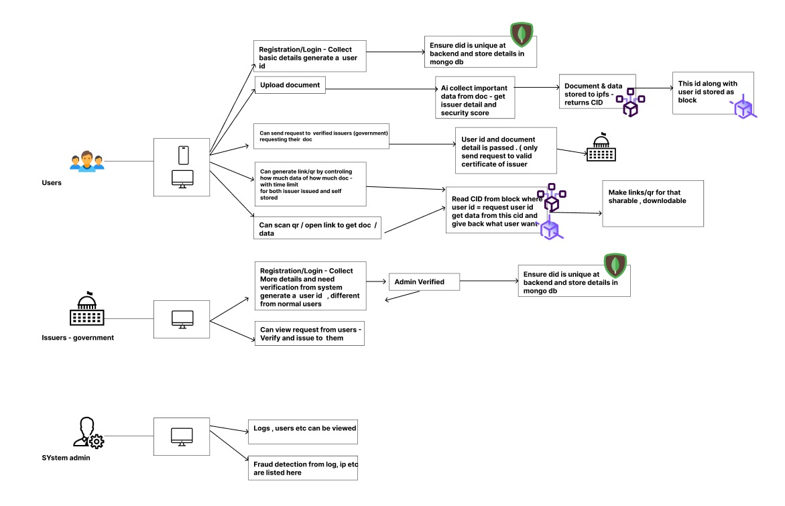

# smrithivault-backend
This is the backend service built with **Node.js** and **Express.js**. It provides RESTful APIs to support the frontend React application.

---


## SmrithiVault – Digital Identity & Document Verification

**Team OpenSmrithi**

SmrithiVault is a blockchain-based platform for secure digital identity and document verification.  
It addresses the inefficiencies of centralized identity systems and enables user-controlled data sharing.  
Documents are uploaded to IPFS, and their hashes are stored on the blockchain for tamper-proof integrity.  
Users can control what data verifiers see and generate offline-verifiable QR codes.  
AI extracts document content and detects fraud through anomaly detection techniques.  
Verifiers scan QR or DID to verify identity without needing full data exposure.  
The system aligns with Self-Sovereign Identity (SSI) principles and UN SDG 16.  
Built using React, Node.js, IPFS, Polygon, Solidity, and Python ML models.  
SmrithiVault ensures privacy, security, and accessibility—online or offline.


---
## Architecture

---
##  Getting Started

### 🔧 Prerequisites

- Node.js (v18+ recommended)
- npm or yarn
- MongoDB 

### 📦 Install Dependencies

```bash
cd smrithivault-backend
npm install
```

###  Run Server

```bash
# Development mode (with nodemon)
npm run dev

# Production mode
npm start
```

Server will run by default on: `http://localhost:3000`

---

---

## 🔐 Environment Variables

Create a `.env` file:

```env
PORT=5000
DB_URI=mongodb://localhost:27017/yourdb
JWT_SECRET=your_secret_key
```

---


## 📝 Commit Message Convention

Follow this convention for commits:

```
<type>(scope): message

Types:
- feat: A new feature
- fix: A bug fix
- docs: Documentation only changes
- style: Formatting, missing semi colons, etc
- refactor: Code change that neither fixes a bug nor adds a feature
- chore: Maintenance
- test: Adding tests
```

**Example:**
```
feat(user): add registration route with JWT
```

---

## ✅ Scripts

| Script         | Description                   |
|----------------|-------------------------------|
| `npm run dev`  | Start server with nodemon     |
| `npm start`    | Start production server       |

---
